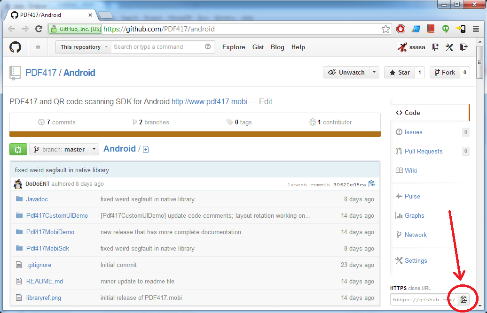
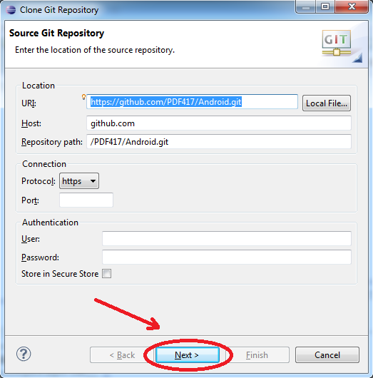
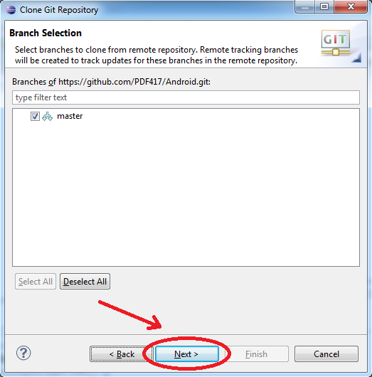
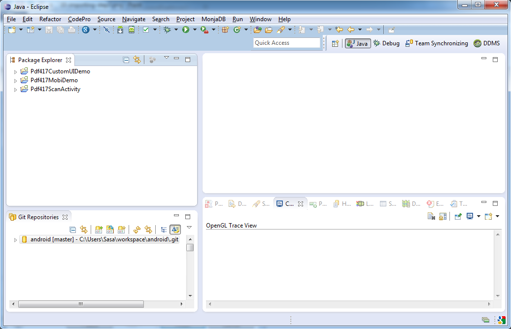
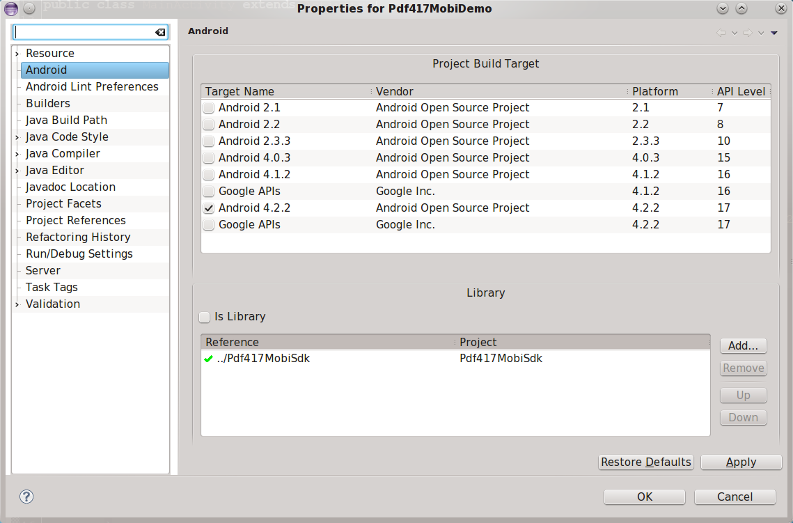

# Android pdf417.mobi integration instructions

The package contains two Android projects: 

 - Pdf417MobiSdk which is the library project which you include in your applications
 - Pdf417MobiDemo demo application which demonstrates the usage of Pdf417MobiSdk
 
 Pdf417.mobi is supported on Android SDK version 8 (Android 2.2) or later.
 
 The project contains one Activity called ScanActivity that is responsible for camera control and barcode recognition

## Quick start to get and run Android demo in Eclipse

1. Go to https://github.com/PDF417/android and copy GitHub code URL as shown on picture:

	

2. Paste this URL to Eclipse Git Repository view:

	

3. Pass through "Clone Git Repository" by clicking Next, Next and Finish:

	
	
	
	
   Cloned project shows as on this picture:

	

4. Right click with your mouse on Package Explorer in Eclipse and then on "Import...":

	

5. Select "Android -> Existing Android Code Into Workspace" and then "Next":

	

6. Click on "Browse..." and then search for "android" folder in your Eclipse workspace. Click OK.

	

7. Just click on Finish to import the three projects:

	

8. Three projects should appear:

	

9. Plugin your Android phone to USB, right click on "Pdf417MobiDemo", then "Run As" and "Android Application" and voila, the app is built, installed and run on your phone:

	

## How to integrate Pdf417MobiSdk into your project

1. Pdf417MobiSdk is an Android Library project with classes, resources and everything required to function properly. 
Simply place the project into your workspace and reference it from your application project. 

	
 	
2. Edit your `AndroidManifest.xml`. You should include camera and camera autofocus features:

   		<uses-permission android:name="android.permission.CAMERA" />

   		<uses-feature android:name="android.hardware.camera" />
    	<uses-feature android:name="android.hardware.camera.autofocus" />
	
	Also, add Pdf417ScanActivity entry:
	
		<activity android:name="mobi.pdf417.activity.Pdf417ScanActivity" android:label="@string/app_name" android:screenOrientation="portrait">
			<intent-filter>
				<action android:name="mobi.pdf417.activity.Pdf417ScanActivity" />
				<category android:name="android.intent.category.DEFAULT" />			
			</intent-filter>
		</activity>
		
3. If you are using ProGuard, add the following lines to your `proguard-project.txt`
 
 		-keep class net.photopay.** { *; }

		-keepclassmembers class net.photopay.** {
    		*;
		}
				
        -keep class mobi.pdf417.** { *; }
        
        -keepclassmembers class mobi.pdf417.** { 
            *; 
        }
        
        -keepattributes InnerClasses

        -keep class **.R
        -keep class **.R$* {
            <fields>;
        }
        
        -dontwarn android.hardware.**

		-dontwarn android.support.v4.**
 
4. You can start scanning process by starting `Pdf417ScanActivity` activity with Intent initialized in the following way:
    
		// Intent for Pdf417ScanActivity.class
		Intent intent = new Intent(this, Pdf417ScanActivity.class);
				
		// Start Activity
		startActivityForResult(intent, MY_REQUEST_CODE);
		

	`Pdf417ScanActivity` will return the result to your activity via intent passed to your `onActivityResult` method after user click `Use` button in dialog shown after successful scan. 
	
	You can use pdf417 SDK free of change and without license key for development and non-commercial projects. Once you obtain a commercial license key from [www.pdf417.mobi](www.pdf417.mobi), you can set it with `EXTRAS_LICENSE_KEY` intent extra like this:
	
		// set the license key
		intent.putExtra(Pdf417ScanActivity.EXTRAS_LICENSE_KEY, "Enter_License_Key_Here");
		
	You can also set additional settings to Intent used for initializing the `Pdf417ScanActivity`:
	
	* If you want sound to be played after the scanning process ends, use `EXTRAS_BEEP_RESOURCE` to set the resource ID of the sound, like this
	
			intent.putExtra(Pdf417ScanActivity.EXTRAS_BEEP_RESOURCE, R.raw.beep);
			
	* If you wany to always use the highest available camera resolution, set `EXTRAS_ALWAYS_USE_HIGH_RES` to true. This is by default enabled for all devices that support at least 720p camera preview frame size. To set this parameter, use the following code snippet:
		
			intent.putExtra(Pdf417ScanActivity.EXTRAS_ALWAYS_USE_HIGH_RES, true);
	
	* if you want to use front facing camera instead of back facing camera, you should set `EXTRA_CAMERA_TYPE` to `CAMERA_FRONTFACE`, like this:
	
			intent.putExtra(Pdf417ScanActivity.EXTRAS_CAMERA_TYPE, (Parcelable)CameraType.CAMERA_FRONTFACE)
			
	* You can use `Pdf417MobiSettings` object to tweak additional scanning parameters. This is entirely optional. If you don't send this object via intent, default scanning parameters will be used - this means both QR and PDF417 codes will be scanned and default camera overlay will be shown. For example, you could set settings as in following example:
	
			Pdf417MobiSettings sett = new Pdf417MobiSettings();
			// set this to true to enable PDF417 scanning
			sett.setPdf417Enabled(true);
			// set this to true to enable QR code scanning
			sett.setQrCodeEnabled(true); 
			// set this to true to prevent showing dialog after successful scan
			sett.setDontShowDialog(false);
			// if license permits this, remove Pdf417.mobi logo overlay on scan activity
			// if license forbids this, this option has no effect
			sett.setRemoveOverlayEnabled(true);
			// put settings as intent extra
			intent.putExtra(BaseBarcodeActivity.EXTRAS_SETTINGS, sett);
	
5. Obtaining the scanned data is done in the `onActivityResult` method. If the recognition returned some results, result code returned will be `BaseBarcodeActivity.RESULT_OK`. Optionally, if user tapped the `Copy` button in dialog, result code returned will be `BaseBarcodeActivity.RESULT_OK_DATA_COPIED` to indicate that barcode data is copied into clipboard. For example, your implementation of this method could look like this:

		@Override
		protected void onActivityResult(int requestCode, int resultCode, Intent data) {
			super.onActivityResult(requestCode, resultCode, data);
			
            if(requestCode==MY_REQUEST_CODE && resultCode==BaseBarcodeActivity.RESULT_OK) {
            	// read scan result
				Pdf417MobiScanData scanData = data.getParcelableExtra(BaseBarcodeActivity.EXTRAS_RESULT);
            
                // read scanned barcode type (PDF417 or QR code)	
                String barcodeType = scanData.getBarcodeType();
                // read the data contained in barcode
                String barcodeData = scanData.getBarcodeData();
                // determine if returned data is uncertain
                boolean uncertainData = scanData.isResultUncertain();
                
                // ask user what to do with data
                Intent intent = new Intent(Intent.ACTION_SEND);
                intent.setType("text/plain");
                intent.putExtra(Intent.EXTRA_TEXT, barcodeType + ": " + barcodeData);
                startActivity(Intent.createChooser(intent, getString(R.string.UseWith)));
            }
		}

6. In order to obtain raw barcode data, you need to obtain `BarcodeDetailedData` structure by calling `getBarcodeRawData` method of `Pdf417ScanData` instance returned via `BaseBarcodeActivity.EXTRAS_RESULT` extra in result intent. This structure will contain list of barcode elements. Each barcode element contains byte array with its raw data and type of that raw data. Type of raw data can be either `ElementType.TEXT_DATA` or `ElementType.BYTE_DATA`. `ElementType.TEXT_DATA` defines that byte array can be interpreted as string, whilst `ElementType.BYTE_DATA` defines that byte array is probably not string. However, you can always convert all data to string and you will then get the same string that you can obtain by calling `getBarcodeData`. For example, you can use that structure like this:

		@Override
		protected void onActivityResult(int requestCode, int resultCode, Intent data) {
			super.onActivityResult(requestCode, resultCode, data);
			
            if(requestCode==MY_REQUEST_CODE && resultCode==BaseBarcodeActivity.RESULT_OK) {
           		// read scan result
				Pdf417MobiScanData scanData = data.getParcelableExtra(BaseBarcodeActivity.EXTRAS_RESULT);
				
                // read raw barcode data
                BarcodeDetailedData rawData = scanData.getBarcodeRawData();				
                // get list of barcode elements
            	List<BarcodeElement> elems = rawData.getElements();
	            // log the amount of elements
    	        Log.i(TAG, "Number of barcode elements is " + elems.size());
        	    // now iterate over elements
            	for(int i=0; i<elems.size(); ++i) {
            		BarcodeElement elem = elems.get(i);
            		// get the barcode element type
            		ElementType elemType = elem.getElementType();
            		// get raw bytes of the element
            		byte[] rawBytes = elem.getElementBytes();
            		
            		// do with that data whatever you want
            		// for example print it
            		Log.i(TAG, "Element #" + i + " is of type: " + elemType.name());
            		StringBuilder sb = new StringBuilder("{");
            		for(int j=0; j<rawBytes.length; ++j) {
            			sb.append((int)rawBytes[j] & 0x0FF);
            			if(j!=rawBytes.length-1) {
            				sb.append(", ");
            			}
            		}
            		sb.append("}");
            		Log.i(TAG, sb.toString());
            	}
			}
		}

    Additionally, if you don't need the whole per element information, you can just use `getAllData` method of `BarcodeDetailedData` class to obtain byte array of the whole barcode. Note that you need to be able to extract useful information from such a byte array on your own.

## Translation and localisation

- Adding new language

	Pdf417.mobi can easily be translated to other languages. The `res` folder in Pdf417MobiSdk library project has folder `values` which contains `strings.xml` - this file contains english strings. In order to make e.g. Croatian translation, create a folder `values-hr` in your project and put the copy of `strings.xml` inside it. Then, open that file and change the english version strings into Croatian version. 

- Modifying other resources.

	You can also modify other resources, such as colours and camera overlay layouts. To change a colour, simply open res/values/colors.xml and change the values of colours. Changing camera overlay layout is explained in demo application called `Pdf417CustomUIDemo`. In order to be able to change camera overlay, you must buy a commercial license.
	
	License key is bound to package name of application which integrates the library. Demo license key works for package name `mobi.pdf417`. To integrate library properly into your application, obtain a license from [PDF417.mobi web]. 
	
## Creating custom camera user interface
As mentioned earlier, you need a commercial license to be able to create custom camera user interface. Example of how this can be done can be found in `Pdf417CustomUIDemo` demo project. The basis of implementing custom camera user interface is in extending `BaseBarcodeActivity` and extending `AbstractViewFinder` classes. Logically, derived class of `BaseBarcodeActivity` will be the activity to which you will have to send initialisation Intent which has the same required extras as described earlier. This activity needs to implement method `onCreateViewFinder` that has to return an implementation of `AbstractViewFinder` abstract class. Now let's explain a bit more about what method you can implement in your derived classes.

### Extending `BaseBarcodeActivity`
Class that extends `BaseBarcodeActivity` must implement method `onCreateViewFinder`. This method is called inside `onCreate` method before building `CameraPreview` View. This method should build and return a class extending `AbstractViewFinder` class that will handle various recognition events, such as detection position, and similar. If you return null, no overlay will be put on camera preview.

Additionally, there are several method you might want to override in your derived activity:

* `onBeforeLoadingCamera` - this method is called inside base activity's `onResume` method just before loading camera. You can use it to perform your own initialisations here. If method returns `true`, camera will be loaded and initialised. If method returns `false`, camera will not be loaded. You might need that behaviour if you want, for example, to display a help activity to user on the first run. Since in that case your scanning activity will exit as soon as it has been started, you can evade camera and native recognizer initalization to save resources and time.
* `onAfterPause` - this method is called as last thing in base activity's `onPause` method. You can use it to perform terminations of your objects before activity goes to pause.
* `isOrientationAllowed` - whenever device orientation change occurs, this method is called to determine if given device orientation is allowed. If method returns true and your implementation of `AbstractViewFinder` has returned a non-null rotatable view, it will be rotated to that orientation.
* `onScanningDone` - this method is called every time a scan operation finishes with result. The scanning result is given as a parameter of the method. If you want to return the result to the calling activity, you should set the activity's result with method `setResult` and call `finish`. If you want to perform more scanning without the need for restarting the activity, you can call `resumeScanning` method from here. `Pdf417CustomUIDemo` application shows an example how to scan 5 barcodes consecutively with 2 seconds pause between each scan.

Besides methods that you are allowed to override, there are several protected final utility methods you can use for your needs.

* `resumeScanning` - this method will perform all required steps for performing a new scan. You will probably need to call this method from overriden `onScanningDone` method.
* `pauseScanning` - this method will perform all required steps for pausing the scanning loop.

### Extending `AbstractViewFinder`
Although all methods in this class have default implementation, the class is kept abstract to prevent instatiations. Class derived from this class is responsible for managing the UI that will be drawn on top of camera preview surface. When you inflate your custom UI from xml or build it in code, you should return it either in method `getRotatableView` or in method `getFixedView`. If you return your View in method `getRotatableView`, your view will be rotated on top of camera surface as device orientation changes occur. If you return your view in method `getFixedView`, your view will always remain in portrait orientation mode (camera activity will always be in portrait mode, regardless of setting in AndroidManifest.xml). If you return both fixed and rotatable views, rotatable view will be layouted on top of fixed view, but touch events will be firstly dispatched to fixed view and then to rotatable view.

Besides mentioned methods there are more methods you might want to override:

* `onSizeChanged` - This method is called before layouting rotatable and fixed views. This also happens every time view orientation change occurs. The reported view and height are corrected for orientation (in landscape mode width is actually height and vice versa). You can use this method for example for adjusting dynamic margins of your views.
* `setOrientation` - This method is called whenever view orientation change occurs. Although you don't need to adapt rotation of the view you return with `getRotatableView`, this method is kept for backward compatibility and for cases when you want to be aware of device orientation change even in your fixed view.
* `showProgress` - this method is called as a notification about scan progress. You can use it to update your progress bar (if you have one). This method is called from non-UI thread.
* `setDefaultTarget` - This method is called to notify viewfinder that it should position itself into its default position. It also gives a hint how to display your viewfinder. Detection status parameter is an integer that can be any constant as defined in `net.photopay.recognition.DetectionStatus`. Show progress is a hint to viewfinder whether or not it should display its progress bar (if it has one.) This method is called from non-UI thread.
* `startProgressAnimation` - if you use smooth animation for animating the progress bar you can start it when this method gets called. This method is called from non-UI thread.
* `setNewTarget` - This method is called to notify viewfinder that object has been detected so that it can draw itself around that object and gives you a hint how to display your viewfinder. Detection status and show progress hints are same as with method `setDefaultTarget`. Corner points of detected object are presented via parameters uleft, uright, lleft and lright. Those parameters are corner points of the detected object that are closest to the real edges of the screen. For example, uleft is the corner point of the object that is closest to the (0,0) coordinate - it does not have to be the actual upper left corner of the object. Parameter uleftIndex can be any integer from 0 to 3 and defines a real upper-left edge of the object (if it is 0, then upper left is given with uleft parameter, if it is 1, then upper left is given with uright parameter etc.). Points coordinates are normalized (coordinate range is from interval [0.0, 1.0]) and placed in image-based coordinate system. The (0,0) coordinate in the image-based coordinate system is the coordinate of the first pixel in image - first pixel in first row. If you are holding your phone in landscape mode, the image-based upper left (coordinate (0,0)) corner will be the same as device's upper left corner. If you are holding your phone in portrait mode, the image-base upper left corner will be the same as device's upper right corner.
* `setPointSet` - This method is called to notify viewfinder that object has been detected so that it can draw interesting points for this object. This method is called from non-UI thread.
* `getRotatableView` - This method is called when adding viewfinder on top of camera surface. This method should return view that will be overlayed on camera. The view returned in this method will be automatically rotated when device orientation changes. If you do not want to rotate your UI, simply return `null` here and return your fixed UI in method `getFixedView`. Of course, you can return both fixed and rotatable view - in this case, rotatable view will be overlayed on top of fixed view which will be overlayed on top of camera surface. Default implementation returns null.
* `shouldAnimateRotation` - You should return true in this method if you want your rotatable UI to be animated while performing a rotation. Default value is false. Note that on some devices animating the rotation sometimes causes draw corruption - this is the reason why is the default return value false.
* `getRotationAnimationDuration` - If you have rotatable view and have enabled rotation animation, you can return animation duration in miliseconds by overriding this method. Default value is 500.
* `getFixedView` - This method is called when adding viewfinder on top of camera surface. This method should return view that will be overlayed on camera. The view returned in this method will not be rotated when device orientation changes. If you want to rotate your UI, simply return `null` here and returned your rotatable UI in method `getRotatableView`. Of course, you can return both fixed and rotatable view - in this case, rotatable view will be overlayed on top of fixed view which will be overlayed on top of camera surface. Default implementation returns null.
* `getInitialOrientation` - This method is called when rotatable view is being layouted on top of camera UI (provided that `getRotatableView` returns non-null). Method should return the initial orientation to which rotatable view will be rotated when initializing the view for the first time.
* `shouldPutInsideCameraSurface` - If method returns `true`, views obtained with `getFixedView` and `getRotatableView` will be layouted inside camera surface. If method returns `false`, views will be layouted over whole `CameraPreview` view. Default implementation returns `true`.
* `displayMessage` - This method is called to notify viewfinder that it should display given message. This method is called from non-UI thread. Default implementation uses `Handler` to invoke `displayMessageImmediately` on UI thread.
* `displayMessageImmediately` - This method is called to notify viewfinder that it should display given message. Unlike `displayMessage`, this method is called on UI thread.
* `displayAutofocusFailed` - This method will be called when camera focusing has failed. Camera manager usually tries different focusing strategies and this method is called when all those strategies fail to indicate that either object on which camera is being focused is too close or ambient light conditions are poor.
* `isAnimationInProgress` -  This method should return `true` if it wants to prevent finishing the activity while some animation is in progress. Default implementation returns `false`.

Besides methods that you are allowed to override, there are several protected final utility methods you can use for your needs.

* `isCameraFocused` - returns `true` if camera thinks it has focused on object. Note that camera has to be loaded for this method to work.
* `focusCamera` - requests camera to perform autofocus. If camera does not support autofocus feature, method does nothing. Note that camera has to be loaded for this method to work.
* `isCameraTorchSupported` - returns `true` if camera supports torch flash mode. Note that camera has to be loaded for this method to work.
* `setTorchEnabled` - if torch flash mode is supported on camera, this method can be used to enable/disable torch flash mode. If operation is successful, method returns true. Note that camera has to be loaded for this method to work.
	
## Troubleshooting

In case of problems with using the SDK, you should do as follows:

* Enable logging to get the ability to see what is library doing. To enable logging, put this line in your application:

		net.photopay.util.Log.setLogLevel(net.photopay.util.LogLevel.LOG_VERBOSE);

After this line, library will display as much information about its work as possible. Make sure to remove this line in your production code as lots of log outputs may slow down the performance of library.

If you cannot solve problems by yourself, do not hesitate to contact us at <pdf417@photopay.net>. Make sure you include the logs when contacting us to minimise the time to find and correct a bug. Also, if having problems reading specific barcodes, please send us high resolution scans of those problematic barcodes.

## Pdf417MobiDemo application

In the package is the working demo application in which you can experiment with integration details. Also, in the package there is `Pdf417CustomUIDemo`

## Additional info

If you have problems running the demo, try multiple refreshes, clean builds, close/open projects and Android Tools -> Fix Project Properties. In many situations this helps.

Also, feel free to contact us at <pdf417@photopay.net>.

[javadoc]: Javadoc/index.html
[PDF417.mobi web]: http://pdf417.mobi