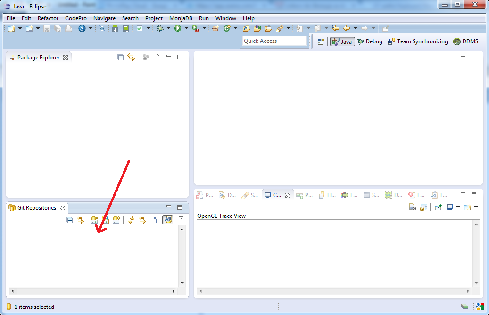
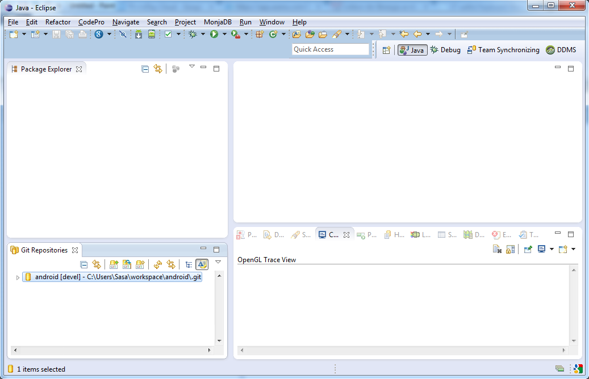
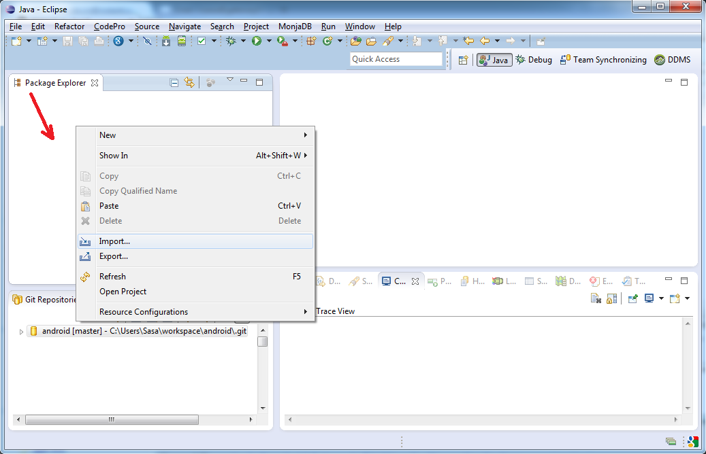
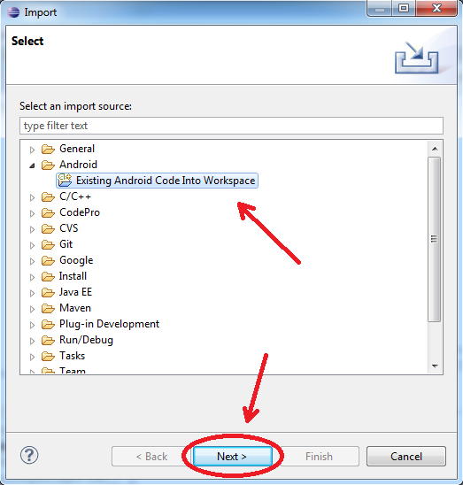
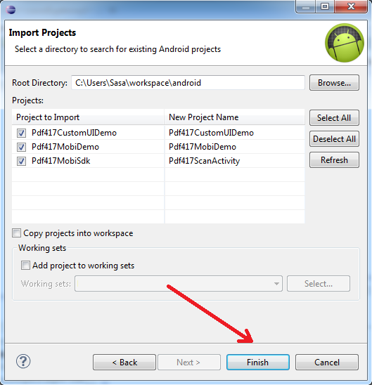

# Android pdf417.mobi integration instructions

The package contains two Android projects: 

 - Pdf417MobiSdk which is the library project which you include in your applications
 - Pdf417MobiDemo demo application which demonstrates the usage of Pdf417MobiSdk
 
 Pdf417.mobi is supported on Android SDK version 8 (Android 2.2) or later.
 
 The project contains one Activity called ScanActivity that is responsible for camera control and barcode recognition

## Quick start to get and run Android demo in Eclipse

1. Go to https://github.com/PDF417/android and copy GitHub code URL as shown on picture:

	

2. Paste this URL to Eclipse Git Repository view:

	

3. Pass through "Clone Git Repository" by clicking Next, Next and Finish:

	
	
	
	
   Cloned project shows as on this picture:

	

4. Right click with your mouse on Package Explorer in Eclipse and then on "Import...":

	

5. Select "Android -> Existing Android Code Into Workspace" and then "Next":

	

6. Click on "Browse..." and then search for "android" folder in your Eclipse workspace. Click OK.

	

7. Just click on Finish to import the three projects:

	

8. Three projects should appear:

	

9. Plugin your Android phone to USB, right click on "Pdf417MobiDemo", then "Run As" and "Android Application" and voila, the app is built, installed and run on your phone:

	

## How to integrate Pdf417MobiSdk into your project

1. Pdf417MobiSdk is an Android Library project with classes, resources and everything required to function properly. 
Simply place the project into your workspace and reference it from your application project. 

	
 	
2. Edit your `AndroidManifest.xml`. You should include camera and camera autofocus features:

   		<uses-permission android:name="android.permission.CAMERA" />

   		<uses-feature android:name="android.hardware.camera" />
    	<uses-feature android:name="android.hardware.camera.autofocus" />
	
	Also, add Pdf417ScanActivity entry:
	
		<activity android:name="mobi.pdf417.activity.Pdf417ScanActivity" android:label="@string/app_name" android:screenOrientation="portrait">
			<intent-filter>
				<action android:name="mobi.pdf417.activity.Pdf417ScanActivity" />
				<category android:name="android.intent.category.DEFAULT" />			
			</intent-filter>
		</activity>
		
3. If you are using ProGuard, add the following lines to your `proguard-project.txt`
 
 		-keep class net.photopay.** { *; }

		-keepclassmembers class net.photopay.** {
    		*;
		}
				
        -keep class mobi.pdf417.** { *; }
        
        -keepclassmembers class mobi.pdf417.** { 
            *; 
        }
        
        -keepattributes InnerClasses

        -keep class **.R
        -keep class **.R$* {
            <fields>;
        }
        
        -dontwarn android.hardware.**

		-dontwarn android.support.v4.**
 
4. You can start scanning process by starting `Pdf417ScanActivity` activity with Intent initialized in the following way:
    
		// Intent for Pdf417ScanActivity
		Intent intent = new Intent(this, Pdf417ScanActivity.class);
				
		// Start Activity
		startActivityForResult(intent, MY_REQUEST_CODE);
		
	`Pdf417ScanActivity` will return the result to your activity via intent passed to your `onActivityResult` method after user click `Use` button in dialog shown after successful scan. 
	
	You can use pdf417 SDK free of change and without license key for development and non-commercial projects. Once you obtain a commercial license key from [www.pdf417.mobi](www.pdf417.mobi), you can set it with `EXTRAS_LICENSE_KEY` intent extra like this:
	
		// set the license key
		intent.putExtra(Pdf417ScanActivity.EXTRAS_LICENSE_KEY, "Enter_License_Key_Here");
		
	You can also set additional settings to Intent used for initializing the `Pdf417ScanActivity`:
	
	* If you want sound to be played after the scanning process ends, use `EXTRAS_BEEP_RESOURCE` to set the resource ID of the sound, like this
	
			intent.putExtra(Pdf417ScanActivity.EXTRAS_BEEP_RESOURCE, R.raw.beep);
			
	* if you want to use front facing camera instead of back facing camera, you should set `EXTRA_CAMERA_TYPE` to `CAMERA_FRONTFACE`, like this:
	
			intent.putExtra(Pdf417ScanActivity.EXTRAS_CAMERA_TYPE, (Parcelable)CameraType.CAMERA_FRONTFACE)
			
	* You can use `Pdf417MobiSettings` object to tweak additional scanning parameters. This is entirely optional. If you don't send this object via intent, default scanning parameters will be used - this means both QR and PDF417 codes will be scanned and default camera overlay will be shown. For example, you could set settings as in following example:
	
			Pdf417MobiSettings sett = new Pdf417MobiSettings();
			// set this to true to enable PDF417 scanning
			sett.setPdf417Enabled(true);
			// set this to true to enable QR code scanning
			sett.setQrCodeEnabled(true); 
			// set this to true to prevent showing dialog after successful scan
			sett.setDontShowDialog(false);
			// if license permits this, remove Pdf417.mobi logo overlay on scan activity
			// if license forbids this, this option has no effect
			sett.setRemoveOverlayEnabled(true);
			// put settings as intent extra
			intent.putExtra(BaseBarcodeActivity.EXTRAS_SETTINGS, sett);
	
5. Obtaining the scanned data is done in the `onActivityResult` method. If the recognition returned some results, result code returned will be `BaseBarcodeActivity.RESULT_OK`. Optionally, if user tapped the `Copy` button in dialog, result code returned will be `BaseBarcodeActivity.RESULT_OK_DATA_COPIED` to indicate that barcode data is copied into clipboard. For example, your implementation of this method could look like this:

		@Override
		protected void onActivityResult(int requestCode, int resultCode, Intent data) {
			super.onActivityResult(requestCode, resultCode, data);
			
            if(requestCode==MY_REQUEST_CODE && resultCode==BaseBarcodeActivity.RESULT_OK) {
                // read scanned barcode type (PDF417 or QR code)
                String barcodeType = data.getStringExtra(BaseBarcodeActivity.EXTRAS_BARCODE_TYPE);
                // read the data contained in barcode
                String barcodeData = data.getStringExtra(BaseBarcodeActivity.EXTRAS_RESULT);
                
                // ask user what to do with data
                Intent intent = new Intent(Intent.ACTION_SEND);
                intent.setType("text/plain");
                intent.putExtra(Intent.EXTRA_TEXT, barcodeType + ": " + barcodeData);
                startActivity(Intent.createChooser(intent, getString(R.string.UseWith)));
            }
		}

6. In order to obtain raw barcode data, you need to obtain `BarcodeDetailedData` structure from `BaseBarcodeActivity.EXTRAS_RAW_RESULT` extra. This structure will contain list of barcode elements. Each barcode element contains byte array with its raw data and type of that raw data. Type of raw data can be either `ElementType.TEXT_DATA` or `ElementType.BYTE_DATA`. `ElementType.TEXT_DATA` defines that byte array can be interpreted as string, whilst `ElementType.BYTE_DATA` defines that byte arrray is probably not string. However, you can always convert all data to string and you will then get the same string that you can obtain from `BaseBarcodeActivity.EXTRAS_RESULT` extra. For example, you can use that structure like this:

		@Override
		protected void onActivityResult(int requestCode, int resultCode, Intent data) {
			super.onActivityResult(requestCode, resultCode, data);
			
            if(requestCode==MY_REQUEST_CODE && resultCode==BaseBarcodeActivity.RESULT_OK) {
                // read raw barcode data
                BarcodeDetailedData rawData = data.getParcelableExtra(BaseBarcodeActivity.EXTRAS_RAW_RESULT);
                            // get list of barcode elements
            	List<BarcodeElement> elems = rawData.getElements();
	            // log the amount of elements
    	        Log.i(TAG, "Number of barcode elements is " + elems.size());
        	    // now iterate over elements
            	for(int i=0; i<elems.size(); ++i) {
            		BarcodeElement elem = elems.get(i);
            		// get the barcode element type
            		ElementType elemType = elem.getElementType();
            		// get raw bytes of the element
            		byte[] rawBytes = elem.getElementBytes();
            		
            		// do with that data whatever you want
            		// for example print it
            		Log.i(TAG, "Element #" + i + " is of type: " + elemType.name());
            		StringBuilder sb = new StringBuilder("{");
            		for(int j=0; j<rawBytes.length; ++j) {
            			sb.append((int)rawBytes[j] & 0x0FF);
            			if(j!=rawBytes.length-1) {
            				sb.append(", ");
            			}
            		}
            		sb.append("}");
            		Log.i(TAG, sb.toString());
            	}
			}
		}

    Additionaly, if you don't need the whole per element information, you can just use `getAllData` method of `BarcodeDetailedData` class to obtain byte array of the whole barcode. Note that you need to be able to extract useful information from such a byte array on your own.

## Translation and localization

- Adding new language

	Pdf417.mobi can easily be translated to other languages. The `res` folder in Pdf417MobiSdk library project has folder `values` which contains `strings.xml` - this file contains english strings. In order to make e.g. croatian translation, create a folder `values-hr` in your project and put the copy od `strings.xml` inside it. Then, open that file and change the english version strings into croatian version. 

- Modifying other resources.

	You can also modify other resources, such as colors and camera overlay layouts. To change a color, simply open res/values/colors.xml and change the values of colors. Changing camera overlay layout is explained in demo application called `Pdf417CustomUIDemo`. In order to be able to change camera overlay, you must buy a license.
	
	License key is bound to package name of application which integrates the library. Demo license key works for package name `mobi.pdf417`. To integrate library properly into your application, obtain a license from [PDF417.mobi web]. 
	
## Troubleshooting

In case of problems with using the SDK, you should do as follows:

* enable logging to get the ability to see what is library doing. To enable logging, put this line in your application:

		net.photopay.util.Log.setLogLevel(net.photopay.util.LogLevel.LOG_VERBOSE);
After this line, library will display as much information about its work as possible. Make sure to remove this line in your production code as lots of log outputs may slow down the performance of library.
* If you cannot solve problems by yourself, do not hesitate to contact us at <pdf417@photopay.net>. Make sure you include the logs when contacting us to minimize the time to find and correct a bug. Also, if having problems reading specific barcodes, please send us high resolution scans of those problematic barcodes.

## Pdf417MobiDemo application

In the package is the working demo application in which you can experiment with integration details.

## Additional info

If you have problems running the demo, try multiple refreshes, clean builds, close/open projects and Android Tools -> Fix Project Properties. In many situations this helps.

Also, feel free to contact us at <pdf417@photopay.net>.

[javadoc]: Javadoc/index.html
[PDF417.mobi web]: http://pdf417.mobi